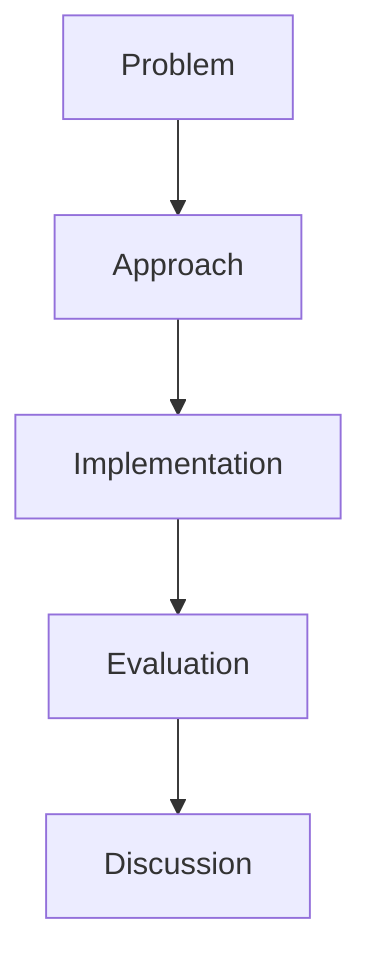

# The Written Thesis

> "Writing is thinking."
> — (thesis as demonstration)

---
layout: default
---

# Conceptual Core

- Structure: problem, approach, impl, eval, discussion
- Clarity, reproducibility
- Citations, figures, appendix

---
layout: default
---

# Conceptual Core (continued)

- Thesis = competency artifact
- Bridge to future work

---
layout: default
---

# Technical Example

- Outline sections
- Draft problem, approach
- Iterate, submit

---
layout: default
---

# Philosophical Reflection

- Documentation = accountability
- Writing = thinking
- Thesis = part of work
.Figure 12.6: Thesis structure template
[plantuml,ch12-l06,png,theme=sketchy-outline]
....
@startuml
start
:Problem;
:Approach;
:Implementation;
:Evaluation;
:Discussion;
stop
@enduml
....

---
layout: default
---

# Discussion Prompts

- How much technical detail belongs in the thesis?
- How do we write for multiple audiences?
- What does "reproducibility" require?

---
layout: default
---

# Diagram

---
layout: default
---

# Lab Prep

- Draft thesis
- Structure
- Iterate, submit

---
layout: center
---

# Questions?
