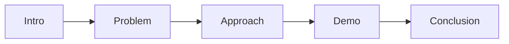

# The Formal Presentation

> "To present is to make the work public."
> — (adapted)

---
layout: default
---

# Conceptual Core

- Format: duration, structure, demo
- Audience: faculty, peers, stakeholders
- Depth vs. accessibility

---
layout: default
---

# Conceptual Core (continued)

- Handle questions, limitations
- Demo makes invisible visible

---
layout: default
---

# Technical Example

- Rehearse
- Demo: live or recorded
- Rehearse. Present. Defend.

---
layout: default
---

# Philosophical Reflection

- Presentation = performance
- Demo reveals
- Accountability
.Figure 12.7: Presentation outline
[plantuml,ch12-l07,png,theme=sketchy-outline]
....
@startuml
start
:Intro;
:Problem;
:Approach;
:Demo;
:Conclusion;
stop
@enduml
....

---
layout: default
---

# Discussion Prompts

- Live demo or recorded? Pros and cons?
- How do we handle technical failures during demo?
- What if the audience challenges your approach?

---
layout: default
---

# Diagram

---
layout: default
---

# Lab Prep

- Rehearse
- Demo ready
- Present, defend

---
layout: center
---

# Questions?
