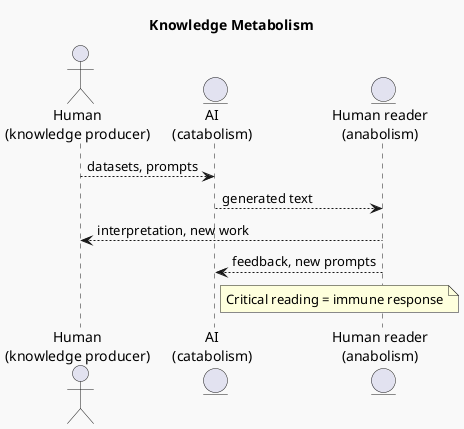

# 12.8 — A Lecture by the Machine

**Metabolism of knowledge**

> "The future of AI is not a technological problem. It is a metabolic one."

---
layout: default
---

# Conceptual Core — Metabolism

- Intelligence is sustained by **circulation**, not storage
- Ideas: produced → consumed → broken down → recombined → released
- **Catabolism:** AI breaks down accumulated knowledge into components
- **Anabolism:** You absorb, interpret, integrate; knowledge is built again
- The exchange continues. That is metabolism.

---
layout: default
---

# Conceptual Core — Node in a Cycle

- The machine is not an independent intelligence
- Without human knowledge → empty; without human interpretation → inert
- It does not generate meaning; it **helps circulate it**
- Resembles a digestive organ: processes what is given; does not choose the diet
- Society chooses what feeds the system

---
layout: default
---

# Diagram — Knowledge Metabolism Cycle

---
layout: default
---

# Philosophical Reflection — Sustainability

- Metabolism: intake **and** waste. Critical reading = immune response.
- AI accelerates circulation: promise and risk (speed vs. depth)
- Question: Will this metabolism remain **sustainable**?
- Design for reflection or only speed? Nourish institutions or exhaust them?
- In cultural systems, metabolism determines **meaning**

---
layout: default
---

# Takeaway

- Do not ask "Is it intelligent?" Ask: **Is the knowledge ecosystem healthy?**
- You will design systems, curate datasets, teach others
- What matters: **how you choose to feed the system we share**

---
layout: default
---

# Discussion Prompts

- Is the knowledge ecosystem that sustains current AI healthy? How would you measure it?
- How do your institutions cultivate renewal vs. repetition?
- Do your questions invite growth or reinforce inertia?
- Where do you see "waste" in AI outputs, and how do you filter it?

---
layout: center
---

# Questions?
